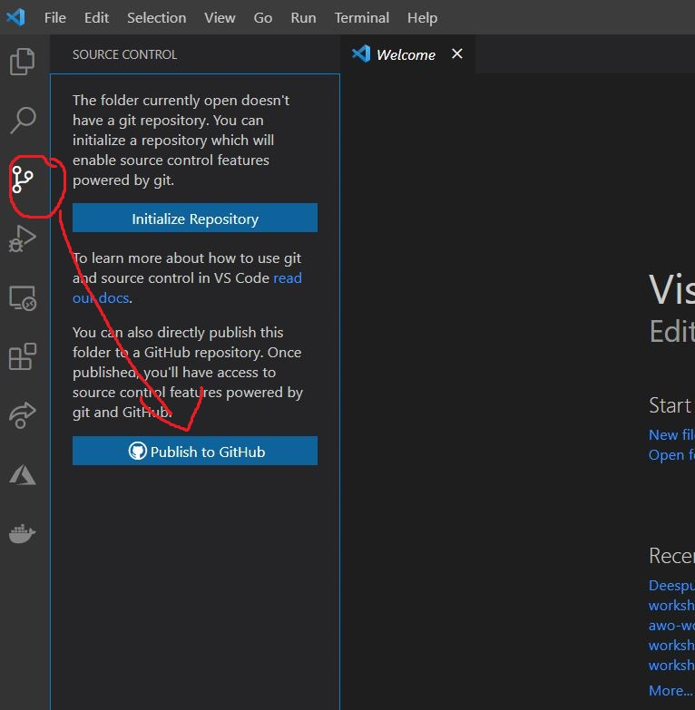
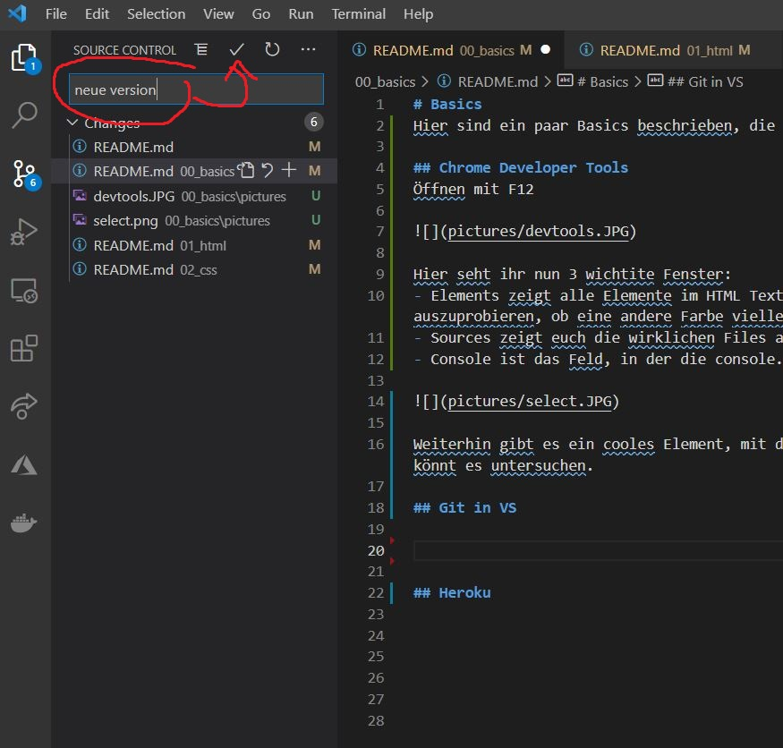
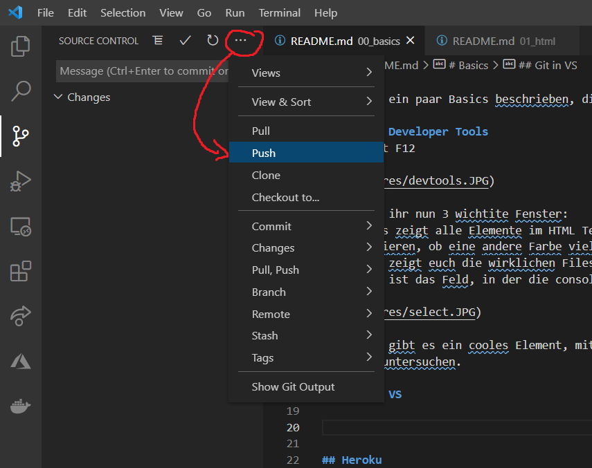
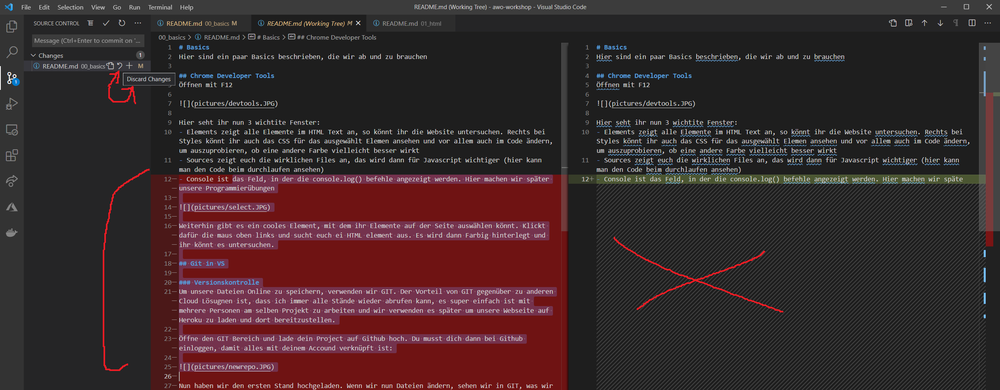
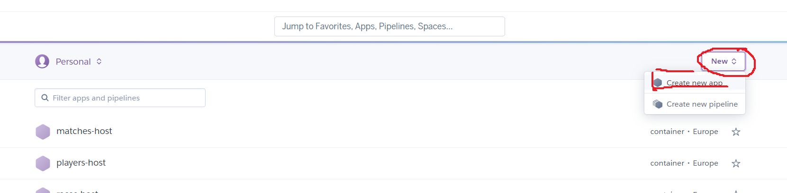
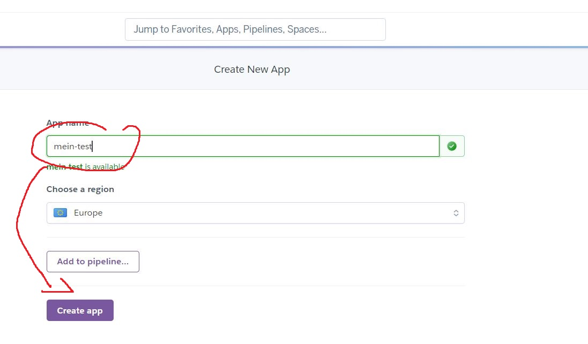
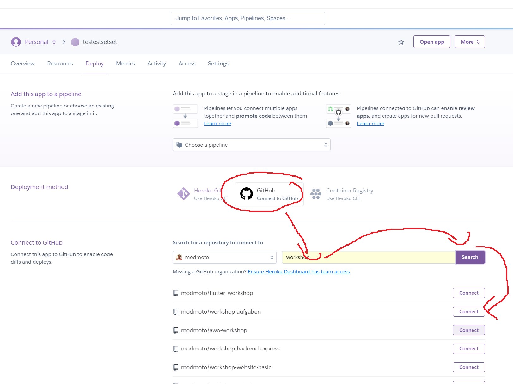
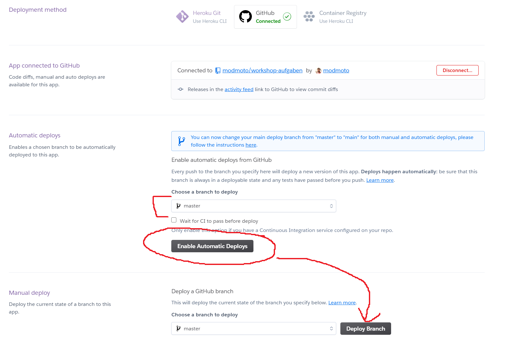
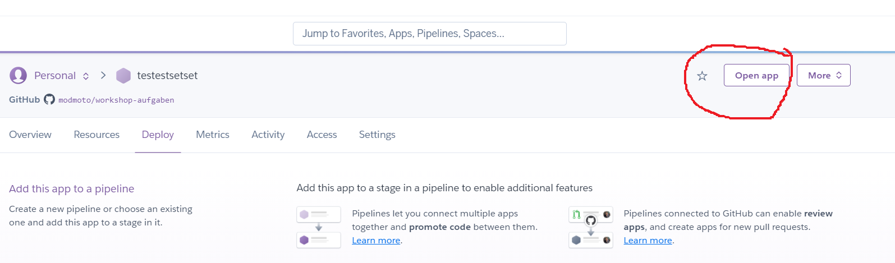

# Basics
Hier sind ein paar Basics beschrieben, die wir ab und zu brauchen

## Chrome Developer Tools
Öffnen mit F12 

Hier seht ihr nun 3 wichtite Fenster:
- Elements zeigt alle Elemente im HTML Text an, so könnt ihr die Website untersuchen. Rechts bei Styles könnt ihr auch das CSS für das ausgewählt Elemen ansehen und vor allem auch im Code ändern, um auszuprobieren, ob eine andere Farbe vielleicht besser wirkt
- Sources zeigt euch die wirklichen Files an, das wird dann für Javascript wichtiger (hier kann man den Code beim durchlaufen ansehen)
- Console ist das Feld, in der die console.log() befehle angezeigt werden. Hier machen wir später unsere Programmierübungen

Weiterhin gibt es ein cooles Element, mit dem ihr Elemente auf der Seite auswählen könnt. Klickt dafür die maus oben links und sucht euch ei HTML element aus. Es wird dann Farbig hinterlegt und ihr könnt es untersuchen.

## Git in VS

### Versionskontrolle
Um unsere Dateien Online zu speichern, verwenden wir GIT. Der Vorteil von GIT gegenüber zu anderen Cloud Lösugnen ist, dass ich immer alle Stände wieder abrufen kann, es super einfach ist mit mehrere Personen am selben Projekt zu arbeiten und wir verwenden es später um unsere Webseite auf Heroku zu laden und dort bereitzustellen.

Öffne den GIT Bereich und lade dein Project auf Github hoch. Du musst dich dann bei Github einloggen, damit alles mit deinem Accound verknüpft ist:

Nun haben wir den ersten Stand hochgeladen. Wenn wir nun Dateien ändern, sehen wir in GIT, was wir geändert haben. Sobald wir damit zufrieden sind, können wir die Änderungen "comitten". Das heißt so etwas wie speichern. Du musst imemr eine speichernachricht eingeben und dann mit dem Haken bestätigen:

Und nun als letzter Schritt können wir die Dateien zu Github hochladen. Hochladen heißt in Github "Push" und geht über das Menü und diesen Button:

Wenn ihr nun auf githugb eure Account öffnet, könnt ihr dort euren Code sehen.

Ein sehr cooles Feature von Git ist, dass ich äderungen nachverfolgen und wieder rückgängig machen kann. Falls ihr mal wieder zum letzten Commit zurück wollt, könnt ihr im Github Fenster per "Discard Changes" eure Änderungen verwerden. Hier im Beispiel habe ich etwas gelöscht (rot), das ich nicht wollte. Mit Discard, kommen wir wieder zum alten Stand zurück.

## Heroku

Jetzt wollen wir die Webseite online verfügbar machen.

Logge dich bei www.heroku.com ein und klicke oben rechts auf "Create New App".

 Vergib im folgenden Menü einen Namen (das wird später die URL unter der ihr eure Website finden könnt) und klicke auf "Create app".

Nun bist du im Übersichtsmenü deiner App. Wir richten jetzt die Verbindung zwischen Github und deiner App ein. Klicke zuerst auf "Connect to github", und logge dich daraufhin bei Github ein. Bestätige alles was du gefragt wirst mit OK. Suche dann in der Suchleiste nach deinem Projekt (Search) und klicke beim richtigen Projekt auf "Connect"

Nun klicken wir nur noch auf "Enable Automatic Deploys" und einmal auf "Deploy", damit die webseite erstellt wird. Sobald ihr nun mit Git wieder pusht, wir wegen "Enable Automatic Deploy" eure Webseite automatisch bei Heroku aktualisiert. Das kann ein paar Sekunden dauern

Öffne nun deine Webseite mit "Open App" oben rechts. 

Herzlichen Glückwunsch, wir sind nun live im Internet =) :clap::clap::clap:

## Übungen GIT
- committe 3 mal eine Änderung
- Ändere etwas und drehe die Änderung zurück (ohne vorher zu committen)
- Checke eine ältere version wieder aus
- Checke wieder den master aus

## Übungen Chrome Devtools
- Mach eine von dir oft besuchte webseite auf und inspecte ein paar Elemente
- Finde ein bestimmtes Bild im Network tab wieder

