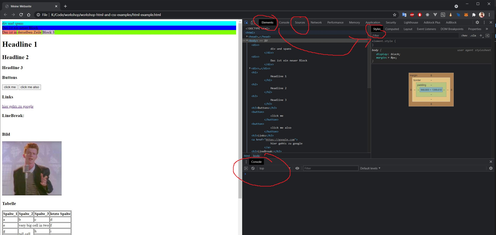

# Basics
Hier sind ein paar Basics beschrieben, die wir ab und zu brauchen

## Chrome Developer Tools
Öffnen mit F12 

Hier seht ihr nun 3 wichtite Fenster:
- Elements zeigt alle Elemente im HTML Text an, so könnt ihr die Website untersuchen. Rechts bei Styles könnt ihr auch das CSS für das ausgewählt Elemen ansehen und vor allem auch im Code ändern, um auszuprobieren, ob eine andere Farbe vielleicht besser wirkt
- Sources zeigt euch die wirklichen Files an, das wird dann für Javascript wichtiger (hier kann man den Code beim durchlaufen ansehen)
- Console ist das Feld, in der die console.log() befehle angezeigt werden. Hier machen wir später unsere Programmierübungen

Weiterhin gibt es ein cooles Element, mit dem ihr Elemente auf der Seite auswählen könnt. Klickt dafür die maus oben links und sucht euch ei HTML element aus. Es wird dann Farbig hinterlegt und ihr könnt es untersuchen.

## Git in VS

## Heroku

