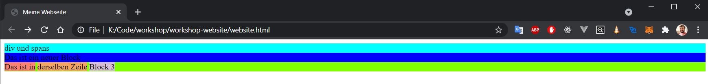
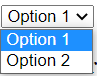

# HTML Basics
HTML steht für "Hypertext Markup Language" und ist im Internet das Standardformat für das Layout von Websiten. Mit HTML beschreibt man, wo welche Elemente auf einer Webseite erscheinen sollen. Dafür schreibt man sein HTML in eine `.html` Datei und öffnet sie in einem beliebigen Browser (Chrome, Edge, Internet Explorer, etc). Der Browser weiß dann, welche Elemente er darstellen soll und wo er sie zu platzieren hat. Wichtig: HTML definiert keine Farben oder wie breit ein Element sein soll. Wie das geht, kommt in den CSS Basics. Auch kann HTML keine Dinge wie Popups darstellen oder Bilder hochladen. Dafür verwendet man Javascript, was wir ebenfalls später behandeln werden. HTML ist ausschließlich für die Formatierung und Elemente der Webseite zuständig.

## Grundgerüst einer Webseite
Kopiere folgenden Text in eine `.html` Datei und öffne sie mit einem Browser:
```
<!doctype html>
<html>
    <head>
        <title>
            Willkommen zu Simons Gästebuch
        </title>
    </head>
    <body>
        Hallo Seminar
    </body>
</html>
```

Das ergibt dann:


herzlichen Grlückwunsch, du hast deine erste Webseite erstellt =) :clap::clap::clap:

### HTML - Elemente
Wie du oben siehst, besteht HTML aus vielen Textstücken, die mit `<>` eingeschlossen sind. Diese Elemente nennt man "HTML-tags". Ein tag hat immer einen Anfang und ein Ende. Das Ende wird mit einem `/` vor dem Tag gekennzeichnet. Alles dazwischen liegt in dem Element und wir vom Browser dann in diesem Element dargestellt. In unserem Beispiel ist das einfach ein Text in dem `<body>` tag.

```
<body> --> Start
    Hallo Seminar
</body> --> Ende
```

In manchen Fällen kann man den tag auch direkt wieder schließen, wenn man keine Elemente in dem Element darstellen will. Dafür kommt das `/` ans Ende des ersten tags. Das sieht dann so aus:
```
<body />
```
ist dasselbe wie
```
<body>
</body>
```
Natürlich sieht man hier nicht wirklich etwas, wir werden diese Art von tags später öfter sehen, deswegen stelle ich sie euch hier vor.

### `<!doctype html>` und `<html>`
Diese beiden ersten tags teilen dem Browser mit, dass der Text in der Datei html enthält. Es gibt auch andere formate, aber für diesen Workshop beschäftigen wir uns nur mit html. Am besten merken, dass die Datei immer mit diesen beiden tags beginnen sollte ;) 

### `<head>`
Im head tag teilt man dem Browser ein paar verstecket Informationen mit, die der User nicht direkt auf der Webseite sieht. Zum Beispiel kann man im head tag Farben für buttons definieren oder den Titel definieren, wie man oben in dem Beispiel sieht. Man kann den head auch komplett weglassen, aber gewöhnlich verwendet man ihn fast immer, weswegen ich ihn hier nicht weglassen wollte. Merkt euch fürs erste, dass ihr hier den Titel des Browser Tabs definieren könnt.

### `<body>`
Der Body ist der komplette Inhalt der WEbseite. Hier werdet ihr Text, Bilder und alles weitere anzeigen, was ihr von einer Webseite gewöhnt seid.

## Container (`<div>` und `<span>`)
In HTML gibt es ein paar unterschiedliche Container, von denen div und span die wichtigsten sind. Ein Container ist ein Block, in dem ihr andere Elemente, wie Bilder oder Text darstellen könnt. Normalerweiße ist eine Webseite aus extrem vielen divs und spans aufgebaut, die in einander verschachtelt sind und somit dann menüs, bildergalerien oder andere komplexere Dinge darstellen. Das div ist dabei das häufigst verwendete element. Der unterschied von div zu span ist im Grunde nur der, dass das div immer die ganze Seite des Browsers einnimmt, während das span hintereinandergereiht und mit Leerzeichen abgetrennt wird. Mit einem div generiert man also eine neue Zeile, während man mit einem span in derselben Zeile weitermachen kann.

Das hier:
```
<div>
    div und spans
</div>
<div>
    Das ist ein neuer Block
</div>
<div>
    <span>Das ist in</span>
    <span>derselben Zeile</span>
    <span>Block 3</span>
</div>
```

ergibt dann das hier (die Farben habe ich hinzugefügt um es klarer zu machen, wie genau das geht, kommt im CSS Teil):




## Überschriften (`<h1>` etc)
Mit den tags `<h1>` bis `<h5>` kann man überschriften definieren, die mit steigender Zahl immer kleiner werden. Also h1 ist für die primäre Überschrift und h2 für ein sekundäres Kapitel.

```
<h1>Headline 1</h1>
<h2>Headline 2</h2>
<h3>Headline 3</h3>
```

ergibt:


## Buttons `<button>`
Mit dem Button tag kann man Buttons darstellen. Wie auch span werden buttons in einer Reihe nebeneinander dargestellt.
```
<button>
    click me
</button>

<button>
    click me also
</button>
```

ergibt:

<button>
    click me
</button>

<button>
    click me also
</button>

## Links `<link>`
Um klickbare Links darzustellen, kann man den a tag verwenden. Weiterhin muss man das Ziel mit dem Attribut `href` angeben.
```
<a href="https://google.com">
    hier gehts zu google
</a>
```

ergibt:
<a href="https://google.com">
    hier gehts zu google
</a>

## Tabellen `<table>`
Tabellen werden nicht mehr so häufig verwendet, aber für das darstellen von vielen Daten auf einmal, machen sie immer noch Sinn. Tabellen haben zwei Sektionen, den `<thead>` und den `<tbody>`. Im thead hat man meistens die BEschreibungen der Spalten und diese werden standardmäßig auch dicher formatiert, damit man es besser erkennt. Für jede Überschrift nimmt man einen `<th>` tag der die Überschrift definiert. Im tbody definiert man dann für jede Reihe eine `<tr>` (TableRow) und für jede Zelle in einer Reihe definiert man ein `<td>` (TableData) element. Wenn man eine Zelle über mehrere Spalten/Reihen ziehen möchte, kann man das mit dem Attribut `rowspan` bzw `colspan` machen. Dann wird die Zelle rechts daneben oder darunter mit dem Inhalt der Zelle erweitert. Am besten mal ein bisschen damit rumspielen, dann wird das klarer.
```
<table>
    <thead>
        <th>
            Spalte_1
        </th>
        <th>
            Spalte_2
        </th>
        <th>
            Spalte_3
        </th>
        <th>
            letzte Spalte
        </th>
    </thead>
    <tbody>
        <tr>
            <td>a</th>
            <td>b</td>
            <td>c</td>
            <td>d</td>
        </tr>
        <tr>
            <td>e</td>
            <td colspan="2">very big cell in two</td>
            <td>f</td>
        </tr>
        <tr>
            <td>g</td>
            <td rowspan="2">tall cell</td>
            <td>h</td>
            <td>i</td>
        </tr>
        <tr>
            <td>j</td>
            <td>k</td>
            <td>l</td>
        </tr>
    </tbody>
</table>
```

ergibt:
<table>
    <thead>
        <th>
            Spalte_1
        </th>
        <th>
            Spalte_2
        </th>
        <th>
            Spalte_3
        </th>
        <th>
            letzte Spalte
        </th>
    </thead>
    <tbody>
        <tr>
            <td>a</th>
            <td>b</td>
            <td>c</td>
            <td>d</td>
        </tr>
        <tr>
            <td>e</td>
            <td colspan="2">very big cell in two</td>
            <td>f</td>
        </tr>
        <tr>
            <td>g</td>
            <td rowspan="2">tall cell</td>
            <td>h</td>
            <td>i</td>
        </tr>
        <tr>
            <td>j</td>
            <td>k</td>
            <td>l</td>
        </tr>
    </tbody>
</table>

## Dropdowns `<select>`
Dropdowns werden mit dem `<select>` tag erstellt und für jede Auswahlmöglichkeit fügt man einen `<option>` tag in das select tag. 
```
<select>
    <option>Option 1</option>
    <option>Option 2</option>
</select>
```

ergibt:



## Textfelder, Checkboxen und Slider`<input>`
Der `<input>` tag ist etwas speziell, da er mehrere Formen annehmen kann, je nachdem welcher wert im `type` Attribut gesetzt wird. Davon gibt es `text`, `range`, `radio` und `checkbox`. Wie man diese Werte dann verarbeitet, kommt im Javascript-Teil. 
```
<span>Text Input:</span>
<input type="text"></br>

<span>Range Input:</span>
<input type="range"></br>

<input type="radio" value="klick1"><span>Option 1</span></br>
<input type="radio" value="klick2"><span>Option 2</span></br>

<input type="checkbox" value="check1"><span>Check 1</span></br>
<input type="checkbox" value="check2"><span>Check 2</span></br>
```

ergibt:


## Listen `<ul>` & `<ol>`
Es gibt zwei Arten von Listen. `<ol>` (OrderedList) ist sortiert und `<ul>` (UnorderedList) ist unsortiert. Sortiert heißt aber nicht, dass die Liste sortiert wird, es werden nur automatisch die Nummern in Zahlen vor die Elemente geschrieben. Die `<li>` (ListItem) tags werden für beide Listen verwendet.
```
<ul>
    <li>item 1</li>
    <li>item 2</li>
    <li>item 3</li>
</ul>

<ol>
    <li>item 1</li>
    <li>item 2</li>
    <li>item 3</li>
</ol>
```

ergibt:
<ul>
    <li>item 1</li>
    <li>item 2</li>
    <li>item 3</li>
</ul>

<ol>
    <li>item 1</li>
    <li>item 2</li>
    <li>item 3</li>
</ol>

## invalides HTML
HTML ist sehr "robust" was Fehler angeht. Wenn man mal vergisst einen tag zu schließen, sieht die Seite oft noch so aus wie vorher. Allerdings liegt das nicht an HTML sondern an den Browsern, die diese Fehler korrigieren und mit der Zeit immer besser geworden sind. Ältere Browser machen gerne mal aus kaputtem HTML auch eine kaputte Webseite. Deswegen rentiert es sich, hier trotzdem sorgfältig zu arbeiten. Probiert gerne mal rum, was euer Browser so aushält.

## Nützliche Links
https://www.w3schools.com/


