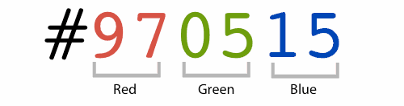
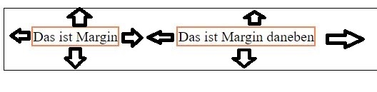

# CSS Basics
CSS steht für "Cascading Style Sheet" und ist auf Webseiten für Farben, Abstände und generelles Design zuständig. Zusammen mit HTML kann der Browser dann erkennen, dass ihr wollt, dass ein bestimmter Button grün sein soll und einen bestimmten Abstand zu einem anderen Element hat. In CSS gibt es oft sehr viele Möglichkeiten ein bestimmtes Design umzusetzen, also kann alles was hier gezeigt wird auf anderen Hilfeseiten komplett anders gelöst sein. Am Anfang geht es uns aber erst einmal darum, etwas Farbe in unser HTML zu bekommen.

Siehe auch die Datei `css-example.html` hier:

https://github.com/modmoto/workshop-html-and-css-examples

## Setup
CSS wird im `<head>` der html Datei definiert. Man kann es auch in einer separaten Datei machen, aber wir machen es uns lieber einfach.
```
<head>
    ...
    <style>
        h3 {
            color: darkolivegreen;
        }
    </style>
</head>
```

Hier zwischen den `<style>` tags schreiben wir nun unser CSS

## Syntax
Eine CSS Anweisung ist sehr simpel und besteht im Grunde nur aus zwei teilen:
```
h3 {
    color: green;
    font-size: 20px;
}
```

Der Teil vor der `{` nennt man Selektor und er definiert, welche Elemente im HTML mit den Styles versehen werden sollen, die im zweiten Teil der Anweisung zwischen den beiden `{}` stehen. Jede Zeile muss mit einem `;` abgeschlossen werden.  Hier gibt es nun fast endlose Möglichkeiten, wie das Styling der Kanten, Durchsichtigkeit, Farben, Abstände, Schriftgröße, Schriftart, Schatten und so weiter. Wir werden hier nur die nötigsten Anweisungen kennenlernen, geh aber gerne auf die Suche nach Styles, die du interessant findest. Google ist hier unsersättlich. In dem Beispiel oben, färben wir alle `<h3>` tags grün und legen die Schriftgröße auf 20 Pixel fest.

## Selektoren 
Selektoren sind wie oben beschrieben der Text, der vor dem `{` kommt. Hier kann man nicht nur HTML Elemente festlegen (wie `<div>` oder `<table>`), sondern auch präziser sein. Das ist sinnvoll, weil man selten alle Elemente einer Webseite gleich aussehen lassen möchte. Manche Buttons sollen größer oder andersfarbig sein als andere, aber man möchte in beiden Fällen den `<button>` tag verwenden. Hier wird am häufigsten dann der `class` oder `id` selector verwendet. 

### Class selektor
Der class Selektor beginnt immer mit einem `.` vor dem Selektor. Damit sagen wir dem Browser, dass er nach HTML Elemente suchen soll, die die Klasse "primary-button" haben. Der Klassenname kann hier frei gewählt werden und am besten sucht man sich einen aus, der gut zum Element passt, also nicht `a1` und `a2` zum Beispiel.
```
.primary-button {
    color: green;
    font-size: 20px;
}
```

Was ist dann eine Klasse?

Die definiert man einfach im HTML mit dem `class` attribute. Wichtig: Hier braucht man den `.` nicht! Das sieht dann so aus:

```
<button class="primary-button">
    Download
</button>
```

### Id selektor
Der id Selektor funktioniert genauso wie der class Selektor, mit dem Unterschied, dass der Selektor im CSS mit einem `#` beginnt und im HTML das `id` attribute gesetzt werden muss.
```
#main-menu {
    color: blue;
    font-size: 50px;
}
```

```
<div id="main-menu">
    <div>Home</div>
    <div>Impressum</div>
</div>
```

### Unterschied von id und class Selektor
Der wichtige Unterschied zwischen class und id ist, dass die id im HTML nur einmal vergeben werden darf, weswegen man das oft für Menüs nimmt, die nur einmal auf der Webseite vorkommen. Das class attribute darf mehrmals auf einer Webseite verwendet werden. Da die modernen Browser meistens doch mit doppelten ids umgehen können, ist das mehr eine Konvention als eine echte Regel. Allerdings kann es bei manchen Fällen sehr komische Auswirkungen haben, die sehr schwer zu finden sind, also bietet es sich an, sich an diese Konvention zu halten. Im Zweifelsfall alles als Klasse markieren und gut ist ;)

### Multiselektoren
CSS kann auch mehrere Elemete gleichzeitig markieren, das geht dann mit einem Komma:
```
.button, .primary-button {
    color: blue;
}
```
Das wirkt sich nun auf beide Klassen `button` und `primary-button` aus.

### Mehrere Klassen pro Element
Umgekehrt kann man aber auch im HTML einem Element mehrere Klassen zuweisen. Dafür muss man im HTML einfach mehrere Klassen in das class Attribute schreiben:
```
<button class="button primary-button">
    Download
</button>
```

Die Styles könnten so aussehen:
```
.button {
    font-size: 20px;
}

.primary-button {
    color: blue;
}

```

### Nested Selektoren
Man kann Selektoren auch verschachteln. Hierbei nimmt man einfach nur ein Leerzeichen zwischen den selektoren
```
.menu div {
    color: blue;
}
```

Hier wird dann in der Klasse menu alle divs genommen und blau gefärbt. Andere divs, die sich nicht in dem menu container befinden werden igoniert.

### Pseudo Selektoren
Pseudo Selektoren sind spezielle Selektoren, die auf eine bestimmte Bedingung reagieren. Ein sehr beliebter davon ist der `:hover` Selektor, der verwendet wird, um zum Beispiel die Farbe eines Buttons zu ändern, wenn die Mouse über den Button "hovert". Ein Pseudo selektor beginnt immer mit `:`. Das sieht dann so aus:
```
.primary-button:hover {
    color: deeppink;
}
```
Ein weiterer beliebter Pseude Selektor sind die `:nth-child(n)` der das n-te Kind eines Elements auswählt. Also `:nth-child(2)` wäre dann das zweite element in einem element. Damit kann man auch abwechselnd stylen, wenn man anstelle einer Zahl `even` oder `odd` verwendet. Dann werden alle geraden bzw ungerade elemente ausgewählt

```
#menu div:nth-child(2) {
    background-color: blue;
}

#menu div:nth-child(odd) {
    background-color: red;
}
```

das liefert dann:


## Farben
Wichtige Farbstyles sind:
- color => legt die Schriftfarbe fest
- border-color => legt die Farbe des Rahmens fest 
- background-color => legt die Farbe im DIV fest

Die Border muss noch mit width und style anegeben werden, sonst wird sie nicht angezeigt

```
.color-example {
    color: red;
}

.border-color-example {
    border-color: red;
    border-width: 2px;
    border-style: solid;
}

.background-color-example {
    background-color: red
}
```

ergibt dann:


Farben können in CSS nicht nur mit normalem Text wie `green` oder `red` definiert werden, sondern auch in einem sogenanten HEX Code. Ein Hexcode wird mit `#` begonnen und hat genau 6 Zeichen. Dabei sind die ersten zwei Zahlen der Wert für rot, dann grün und dann blau. Das ist der sogenannte "RGB" Wert (rot, grün, blau). 



Allerdings gehen die Zahlen eigentlich von 0-255. Ab 100 sind das mehr als zwei Zeichen, weswegen die Zahlen "HEX" codiert werden. HEX ist ein Zahlenraum, der nicht von 0-9 geht, sondern von 0-F. Man führt Hex Zahlen dann auch oft mi 0x oder # an, um klarzumachen, dass es sich um eine HEX Codierung handelt. 

Die ersten paar Zahlen sehen dann also so aus:
<table>
<tr>
<td>Normal</td>
<td>HEX</td>
</tr>
<tr>
<td>1</td>
<td>#1</td>
</tr>
<tr>
<td>2</td>
<td>#2</td>
</tr>
<tr>
<td>3</td>
<td>#3</td>
</tr>
<tr>
<td style="text-align: center" colspan=2>etc...</td>
</tr>
<tr>
<td>10</td>
<td>#A</td>
</tr>
<tr>
<td>11</td>
<td>#B</td>
</tr>
<tr>
<td>12</td>
<td>#C</td>
</tr>
<tr>
<td>13</td>
<td>#D</td>
</tr>
<tr>
<td>14</td>
<td>#E</td>
</tr>
<tr>
<td>15</td>
<td>#F</td>
</tr>
<tr>
<td>16</td>
<td>#10</td>
</tr>
<tr>
<td>17</td>
<td>#11</td>
</tr>

</tr>
</table>

Das muss nicht verstanden werden, in VS gibt es einen Color Picker, mit dem ihr einfach die Farben auswählen könnt ;)

Gut zu wissen:
`#00 00 00` ist schwarz und `#FF FF FF` ist weiß. Sobald alle Werte gleich sind, ist keine Farbe mehr vorhanden als die anderen und damit handelt es sich immer um ein mehr oder weniger helles grau. Also ein `#AA AA AA` ist ein helles grau, während `#05 05 05` ein recht dunkles grau ist. Man kann HEX in CSS auch abkürzen, wenn die RGB Werte gleich sind. Also `#AA AA AA` ist dasselbe wie `#AAA` oder `#00 99 AA` entspricht `#09A`.

## Größe
- width
- height

Wird mit Pixel oder Prozent angegeben. Die % bezieht sich immer auf das Element außen rum. Also wenn das Element außen 100 breit ist und ein Kind `width: 50%;` hat, ist es 50 Pixel breit. Beispiel dazu:

```
.container {
    width: 100px;
    height: 150px;
}

.container div {
    width: 50%;
}
```

## Abstand
Abstand zwischen zwei Elementen kann mit `padding` oder `margin` generiert werden. Dabei ist `margin` der Abstand nach außen und `padding` der Abstand nach innen. Wenn du du also bei einem Button willst, dass er eher so aussieht:


Wenn du möchtest, dass er mehr abstand zu seinen nachbarn hat, verwendet margin, wie hier:



Im CSS sieht das dann so aus:

```
.padding-example {
    padding: 30px;
}

.margin-example {
    margin: 30px;
}
```

Man kann `padding` und `margin` auch mit einem suffix von `-top`, `-bottom`, `-left`, und `-right` angeben, um nur eine bestimmte Seite zu verändern:

```
.mixed-example {
    margin-left: 20px;
    margin-right: 20px;

    padding-top: 30px;
    padding-bottom: 30px;
}
```

## CSS direkt in HTML
Man kann auch einen style direkt an einem html element definieren. Man tut das allerdings nur sehr selten, da es schnell sehr unübersichtlich wird. Für schnelles austesten ist es allerdings gut. Hier beachten, dass auch jeder Style mit einem `;` abgeschlossen werden muss. Sobald es also mehr als 2-3 Anweisungen sind, wird es sehr unübersichtlich. Das sieht dann so aus:

```
<div style="border: 1px solid red; background-color: aquamarine;">
    gestyled
</div>
```
