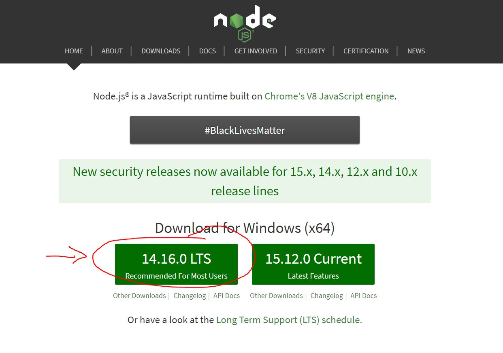
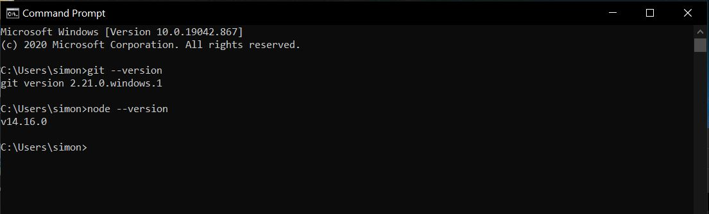

Hallo liebe Freiwillige,

hier trage ich alle nötigen Informationen für unser Seminar ein, damit ihr diese später immer nachlesen könnt. 

## Projekte für das Seminar:
Diese Projekte sind hier verlinkt, damit ihr sie später leichter findet. Bis zum Seminar braucht ihr die noch nicht.

https://github.com/modmoto/workshop-html-and-css-examples

https://github.com/modmoto/workshop-aufgaben

https://github.com/modmoto/workshop-website-basic

https://github.com/modmoto/workshop-website-vue

https://github.com/modmoto/workshop-backend-express


# Wochenplan
Start: 9:30 (Mit einer Pause zwischendrin)

Mittag 12:00 - 13:00

Ende: 15:00

Am Montag würde ich um 15:00 Uhr noch anbieten, dass wir zusammen eure erstellten Webseiten online stellen, damit ihr die Seiten live im Internet habt. Das geht Maxinmal 30 Minuten extra und ist kein Pfichtteil.

Themen:
- Montag: HTML
- Dienstag: CSS
- Mittwoch: Javascript
- Donnerstag: Vue
- Freitag: Vue 


# Todos vor dem Kurs
Um in der Seminarwoche direkt loslegen zu können, brauchen wir noch ein zwei Installationen, damit wir arbeiten können. Ich erkläre hier, wie ihr das installieren könnt. Keine Angst, es ist einfacher, als es zuerst aussieht ;)

## Visual Studio Code
Download: https://code.visualstudio.com/

Visual Studio Code (auch VS genannt) ist ein Texteditor, mit dem wir unsere Webseite bearbeiten werden. Er kommt von Microsoft und ist kostenlos, aber trotzdem sehr gut und auch weit verbreitet. Wenn ihr schon etwas Programmiererfahrung habt und euch ein anderer Editor besser gefällt, könnt ihr den natürlich auch nehmen. Im Seminar werde ich allerdings alle Beispiele mit VS vorstellen. Lass bei der Installation einfach alles auf den Standardeinstellungen und klicke dich durch.


## Node
Download: https://nodejs.org/en/

Node ist ein Programm, das einige Sachen beim Programmieren vereinfacht. Was genau ist schwer zu erklären, wenn du noch keine Erfahrung mit programmieren hast. Vertrau mir einfach, dass wir es brauchen und es nützlich ist ;) Lass auch hier bei der Installation einfach alles auf den Standardeinstellungen und klicke dich durch.




# Optionale Software
Wenn ihr später die Webseite noch wirklich ins Internet bringen wollt, braucht ihr noch GIT und die Logins zu GIthub und Heroku. Hier erkläre ich, wie das geht.

## GIT 
Download: https://git-scm.com/download/win

GIT ist ein sogenanntes Versionskontrollsystem. Was das genau ist, erkläre ich später im Seminar. Um es kurz zu machen: Mit GIT ladet ihr eure gebastelte Webseite in die Cloud, wo wir sie dann später über einen Browser ansehen können. Lass bei der Installation einfach alles auf den Standardeinstellungen und klicke dich durch. Es sind relativ viele Screens, bis man fertig ist, nur damit du nicht denkst, du bist irgendwo falsch abgebogen. 


## Logins:
Wir brauchen auch noch ein Nutzerkonto für folgende Webseiten. Merkt euch das passwort am besten ;). Es reicht wenn ihr euch testweise einmal einloggt, was genau die Webseiten machen erkläre ich dann im Seminar.

### Github
http://github.com/

Github ist eine Webseite für GIT (siehe oben). Das ist dann die Cloud, in der wir unsere Webseite mit GIT hochladen.


### Heroku
https://www.heroku.com/

Heroku ist der Ort, wo wir unsere Webseite erreichen können. Ihr bekommt hier eine URL, wie zum Beispiel https://simon-guestbook-vue.herokuapp.com/ (das erste aufrufen dauert immer ein bisschen) auf der ihr dann eure Webseite aufrufen könnt.

## Funktion überprüfen (optional, aber empfohlen)
Um zu sehen, ob alles richtig funktioniert, drückt die Windows Taste und tippt einfach `cmd` auf der Tastatur. Ihr könnt auch die Suche Funktion klicken und dort `cmd` eingeben. Klickt dann auf das Programm `Eingabeaufforderung`. Wir überprüfen nun, ob die Programme richtig installiert wurden.


Tippt nun folgenden Befehl und drückt `enter`
```
git --version
```
danach dasselbe mit
```
node --version
```

Die `Eingabeaufforderung` sollte euch nun die Version von GIT und Node ausgegeben haben, das bedeutet, dass die Programme erfolgreich installiert wurden. Es sollte folgendermaßen aussehen (die Nummern können abweichen)



Falls folgende Ausgabe kommt:
```
.... is not recognized as an internal or external command, operable program or batch file.
```
Ist etwas bei der Installation schief gegangen. Melde dich am besten bei mir, damit wir das Problem vor dem Seminar lösen können.

Sonst klappt nun alles, Glückwunsch! :clap::clap::clap:
