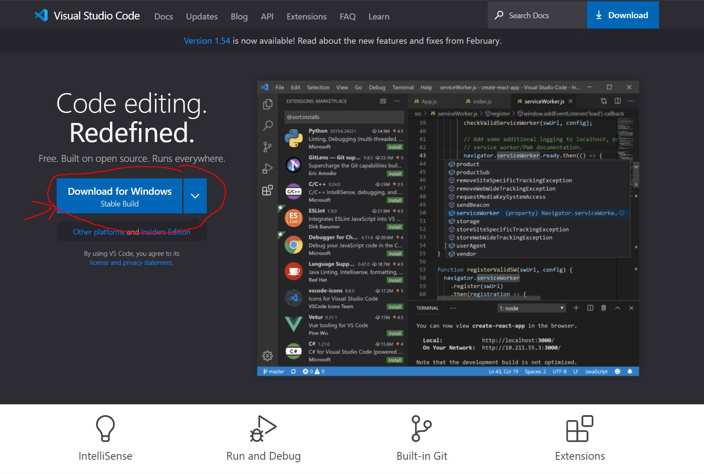
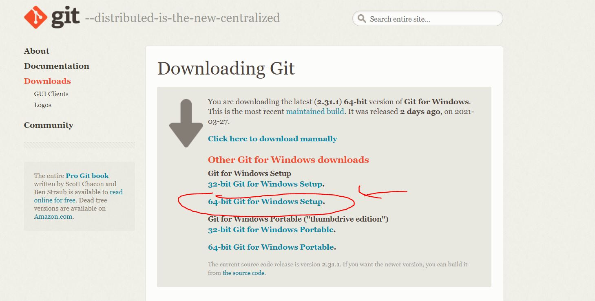
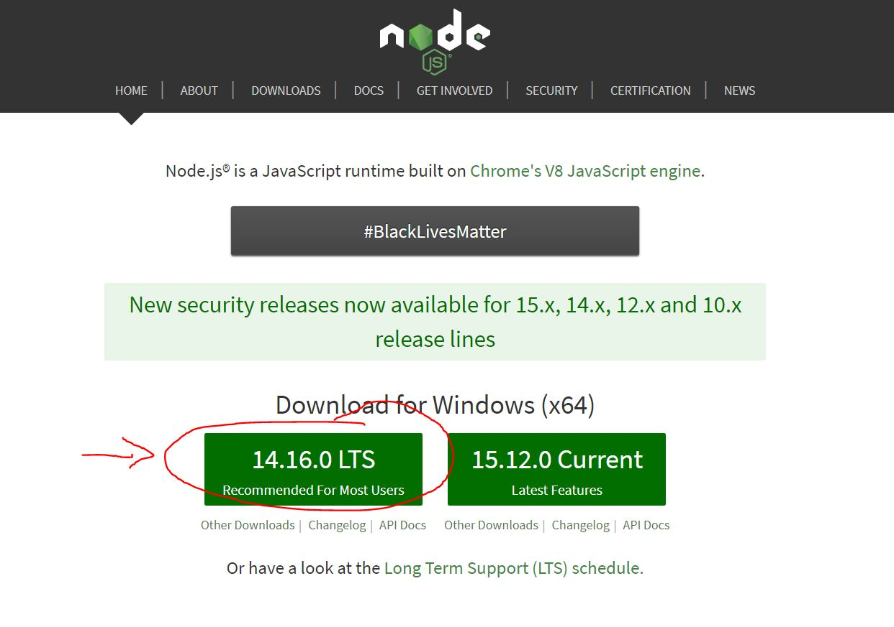
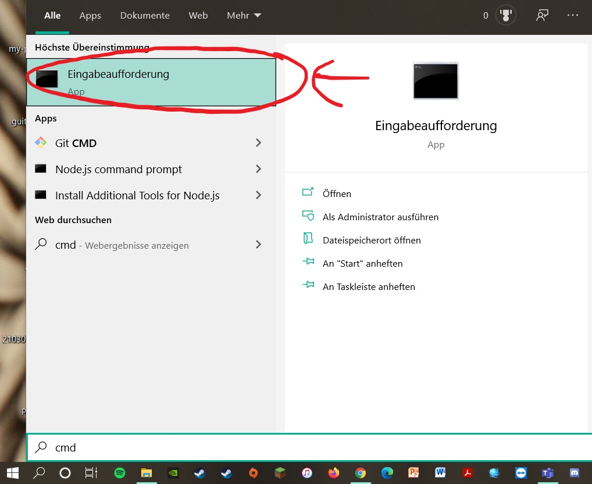
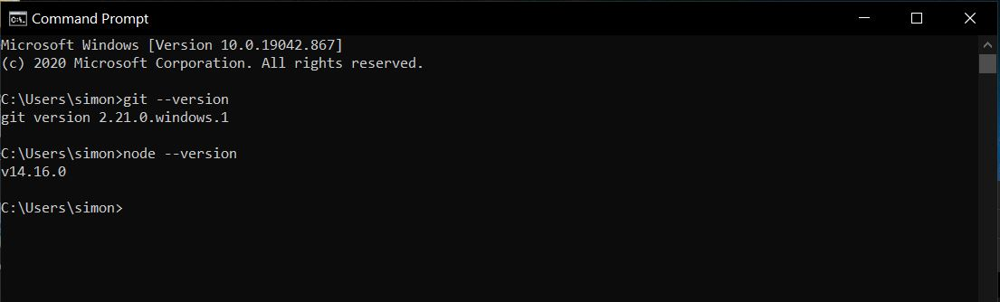

Hallo liebe Freiwilligen,

hier trage ich alle nötigen Informationen für unseren Workshop ein, damit ihr diese später immer nachlesen könnt. 

# Todos vor dem Kurs
Um in der Seminarwoche direkt loslegen zu können, brauchen wir noch ein bisschen Software. Ich erkläre hier, wie ihr das installieren könnt. Keine Angst, es ist einfacher, als es zuerst aussieht ;)

## Visual Studio Code
Visual Studio Code (auch VS genannt) ist ein Texteditor, mit dem wir unsere Webseite bearbeiten werden. Er kommt von Microsoft und ist kostenlos, aber trotzdem sehr gut und auch weit verbreitet. Wenn ihr schon etwas Programmiererfahrung habt und euch ein anderer Editor besser gefällt, könnt ihr den natürlich auch nehmen. Im Workshop werde ich allerdings alle Beispiele mit VS vorstellen. Lass bei der Installation einfach alles auf den Standardeinstellungen und klicke dich durch.

https://code.visualstudio.com/



## GIT
GIT ist ein sogenanntes Versionskontrollsystem. Was das genau ist, erkläre ich später im Workshop. Um es kurz zu machen: Mit GIT ladet ihr eure gebastelte Webseite in die Cloud, wo wir sie dann später über einen Browser ansehen können. Lass bei der Installation einfach alles auf den Standardeinstellungen und klicke dich durch. Es sind relativ viele Screens, bis man fertig ist, nur damit du nicht denkst, du bist irgendwo falsch abgebogen. 

https://git-scm.com/download/win



## Node
Node ist ein Programm, das einige Sachen beim Programmieren vereinfacht. Was genau ist schwer zu erklären, wenn du noch keine Erfahrung mit programmieren hast. Vertrau mir einfach, dass wir es brauchen und es nützlich ist ;) Lass auch hier bei der Installation einfach alles auf den Standardeinstellungen und klicke dich durch.

https://nodejs.org/en/



## Funktion überprüfen
Um zu sehen, ob alles richtig funktioniert, drückt die Windows Taste und tippt einfach `cmd` auf der Tastatur. Ihr könnt auch die Suche Funktion klicken und dort `cmd` eingeben. Klickt dann auf das Programm `Eingabeaufforderung`. Wir überprüfen nun, ob die Programme richtig installiert wurden.



Tippt nun folgenden Befehl und drückt `enter`
```
git --version
```
danach dasselbe mit
```
node --version
```

Die `Eingabeaufforderung` sollte euch nun die Version von GIT und Node ausgegeben haben, das bedeutet, dass die Programme erfolgreich installiert wurden. Es sollte folgendermaßen aussehen (die Nummern können abweichen)



Falls folgende Ausgabe kommt:
```
.... is not recognized as an internal or external command, operable program or batch file.
```
Ist etwas bei der Installation schief gegangen. Melde dich am besten bei mir, damit wir das Problem vor dem Workshop lösen können.

Sonst klappt nun alles, Glückwunsch! :clap::clap::clap:


## Logins:
Wir brauchen auch noch ein Nutzerkonto für folgende Webseiten. Merkt euch das passwort am besten ;). Es reicht wenn ihr euch testweise einmal einloggt, was genau die Webseiten machen erkläre ich dann im Workshop.

### Github
Github ist eine Webseite für GIT (siehe oben). Das ist dann die Cloud, in der wir unsere Webseite mit GIT hochladen.
http://github.com/

### Heroku
Heroku ist der Ort, wo wir unsere Webseite erreichen können. Ihr bekommt hier eine URL, wie zum Beispiel https://simons-guestbook.herokuapp.com auf der ihr dann eure Webseite aufrufen könnt.
https://www.heroku.com/
