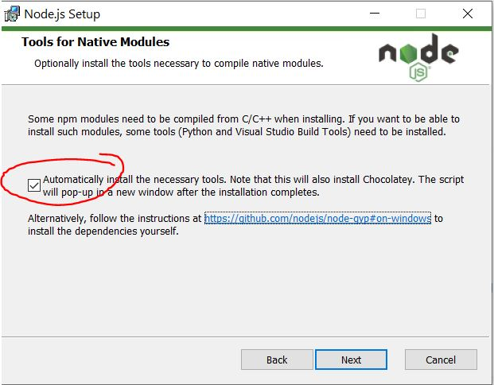
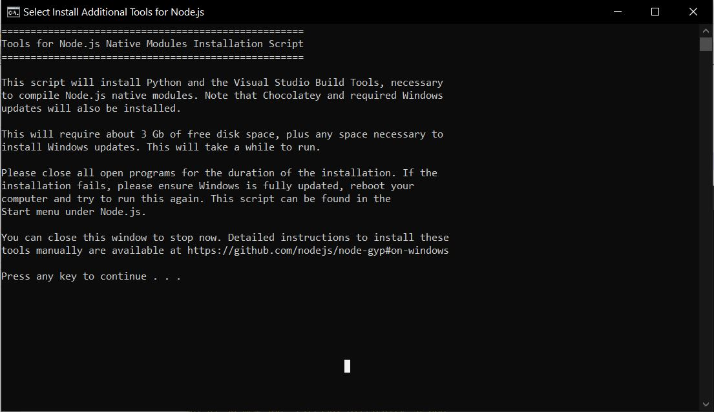
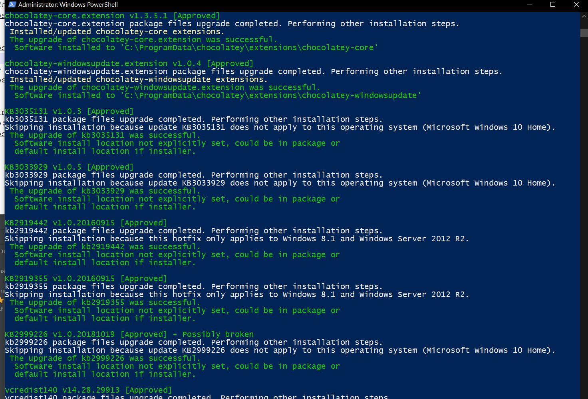

Hallo liebe Freiwilligen,

hier trage ich alle nötigen Informationen für unseren Workshop ein, damit ihr diese später immer nachlesen könnt. 

# Todos vor dem Kurs
Um in der Seminarwoche direkt loslegen zu können, brauchen wir noch ein bisschen Software. Ich erkläre hier, wie ihr das installieren könnt. Keine Angst, es ist einfacher, als es zuerst aussieht ;)

## Visual Studio Code
Visual Studio Code (auch VS genannt) ist ein Texteditor, mit dem wir unsere Webseite bearbeiten werden. Er kommt von Microsoft und ist kostenlos, aber trotzdem sehr gut und auch weit verbreitet. Wenn ihr schon etwas Programmiererfahrung habt und euch ein anderer Editor besser gefällt, könnt ihr den natürlich auch nehmen. Im Workshop werde ich allerdings alle Beispiele mit VS vorstellen. Lass bei der Installation einfach alles auf den Standardeinstellungen und klicke dich durch.

https://code.visualstudio.com/


## GIT
GIT ist ein sogenanntes Versionskontrollsystem. Was das genau ist, erkläre ich später im Workshop. Um es kurz zu machen: Mit GIT ladet ihr eure gebastelte Webseite in die Cloud, wo wir sie dann später über einen Browser ansehen können. Lass bei der Installation einfach alles auf den Standardeinstellungen und klicke dich durch.

https://git-scm.com/download/win


## Node
Node ist ein Programm, das einige Sachen beim Programmieren vereinfacht. Was genau ist schwer zu erklären, wenn du noch keine Erfahrung mit programmieren hast. Vertrau mir einfach, dass wir es brauchen und es nützlich ist ;)
Die Installation kann etwas länger gehen, also ein paar Minuten.

**WICHTIG!!:**

Bei der Installation gibt es einen wichtigen Haken, den ihr setzen müsst! Wenn ihr das nicht tut, muss man noch andere Programme von Hand installieren und das ist etwas nervig. Falls ihr es übersehen haben solltet, könnt ihr den Installer einfach noch einmal starten und dann den Haken auswählen. 

https://nodejs.org/en/

Ladet es euch erst runter:


Wenn dieser Bildschirm kommt, klickt den Haken!



Danach fordert euch der Installer auf, einmal eine Taste zu drücken um den Rest der Software zu installieren. Das sollte nun ein paar Minuten dauern.



Es sollte nun ein Haufen Text an euch vorbeirauschen



## Funktion überprüfen
Um zu sehen, ob alles richtig funktioniert, drückt die Windows Taste und gebt `cmd` in die Suche ein. Klickt dann auf das Programm `Eingabeaufforderung`.


Tippt nun folgenden Befehl und drückt `enter`
```
git --version
```
danach dasselbe mit
```
node --version
```

nun sollte folgende Ausgabe zu sehen sein (die Nummern können abweichen)


Falls folgende Ausgabe kommt:
```
.... is not recognized as an internal or external command, operable program or batch file.
```
Ist etwas bei der Installation schief gegangen. Melde dich am besten bei mir, damit wir das Problem vor denm Workshop lösen können.

Sonst klappt nun alles, Glückwunsch!


## Logins:
Wir brauchen auch noch ein Nutzerkonto für folgende Webseiten. Merkt euch das passwort am besten ;). Es reicht wenn ihr euch testweise einmal einloggt, was genau die Webseiten machen erkläre ich dann im Workshop.

### Github
Github ist eine Webseite für GIT (siehe oben). Das ist dann die Cloud, in der wir unsere Webseite mit GIT hochladen.
http://github.com/

### Heroku
Heroku ist der Ort, wo wir unsere Webseite erreichen können. Ihr bekommt hier eine URL, wie zum Beispiel https://simons-guestbook.herokuapp.com auf der ihr dann eure Webseite aufrufen könnt.
https://www.heroku.com/
